# 🧩 Introduction to Operating Systems


Welcome to the ultimate guide to understanding Operating Systems! This document is designed for everyone, from absolute beginners to those looking to refresh their advanced knowledge. We'll break down every core concept in a clear, step-by-step manner.

---

## ✨ **Table of Contents**

1.  [What is an Operating System?](#-1-what-is-an-operating-system)
2.  [Functions of Operating Systems](#-2-functions-of-operating-systems)
3.  [Types of Operating Systems](#-3-types-of-operating-systems)
4.  [Kernel vs Shell](#-4-kernel-vs-shell)
5.  [System Calls](#-5-system-calls)
6.  [Real-World Applications](#-6-real-world-applications)
7.  [Interview Questions & Memory Aids](#-7-interview-questions--memory-aids)
8.  [References](#-8-references-trustworthy)

---

## 🔹 **1. What is an Operating System?**

An Operating System (OS) is the most important software that runs on a computer. It acts as a master controller, managing all the hardware and software resources. Think of it as the "government" for your computer.

#### **OS as an Interface**

The OS is a crucial intermediary (a translator or a manager) that sits between you (the user) and the computer's physical hardware. You cannot directly tell the CPU what to do. Instead, you interact with applications, and the OS relays your commands to the hardware.

#### **Visual Diagram: The OS Layer**

This simple diagram shows the position of the OS in a computer system.

```mermaid
graph TD
    subgraph User's World
        User(👤 User)
        Application(📱 Application e.g., Chrome, VS Code)
    end

    subgraph System World
        OS(🖥️ Operating System e.g., Windows, macOS, Linux)
        Hardware(⚙️ Hardware e.g., CPU, RAM, Disk)
    end

    User --> Application
    Application -- System Calls --> OS
    OS -- Drivers/Instructions --> Hardware
````

-----

## 🔹 **2. Functions of Operating Systems**

An OS performs many critical functions to ensure the computer works smoothly. Here are the main ones:

-----

### 💾 **Memory Management**

  - **What it is:** The OS is responsible for allocating and deallocating memory space to programs that need it. It ensures that one program does not interfere with the memory of another.
  - **Analogy:** Imagine a librarian managing a library's shelves. The librarian (OS) assigns a specific shelf (memory location) to each person (program) who wants to read a book. When they're done, the librarian frees up the shelf for someone else.
  - **Diagram:**
    ```
    RAM (Main Memory)
    +--------------------------------+
    |      Operating System          | -----------------> [Reserved for OS]
    +--------------------------------+
    |      Program A (Chrome)        | -----------------> [Allocated by OS]
    +--------------------------------+
    |      Program B (Spotify)       | -----------------> [Allocated by OS]
    +--------------------------------+
    |      Free Space                | -----------------> [Managed by OS]
    +--------------------------------+
    |      Program C (Game)          | -----------------> [Allocated by OS]
    +--------------------------------+
    ```

-----

### ⏱️ **Process Management**

  - **What it is:** In a computer, a "process" is any program in execution. The OS manages the lifecycle of these processes, deciding which process gets the CPU and for how long. This is called **scheduling**.
  - **Analogy:** Think of a busy chef (CPU) in a kitchen. The head chef (OS scheduler) gives the chef a sequence of orders (processes) to work on. The head chef decides which dish to prepare first, for how long to cook it, and when to switch to another dish to keep all customers happy.
  - **Diagram:**
    ```mermaid
    graph TD
        A[New Process] --> B(Ready Queue);
        B -- Scheduler Dispatches --> C{CPU Execution};
        C --> D(Terminated);
        C -- I/O or Event Wait --> E(Waiting Queue);
        E -- I/O or Event Complete --> B;
    ```

-----

### 💽 **File Management**

  - **What it is:** The OS manages all the files and folders on your system. It handles how data is stored, retrieved, named, shared, and protected. It presents a neat hierarchical structure of directories and files.
  - **Analogy:** This is like a highly organized filing cabinet system in an office. The office manager (OS) decides how to label folders (directories), where to put documents (files), who can access them, and how to find them quickly.
  - **Diagram:**
    ```
    File System Hierarchy

        / (Root)
        ├── /bin      (Essential binaries)
        ├── /home
        │   ├── /user1
        │   │   ├── Documents
        │   │   └── Pictures
        └── /var      (Variable files)
    ```

-----

### 🌐 **Device Management**

  - **What it is:** The OS manages all peripheral devices like printers, disk drives, keyboards, and mice. It communicates with these devices through special software called **device drivers**.
  - **Analogy:** Imagine a symphony conductor (OS). The conductor doesn't play the instruments but directs each musician (device) when to play, how loud, and for how long, ensuring they all work in harmony. The sheet music for each instrument is like its device driver.
  - **Diagram:**
    ```mermaid
    graph LR
        UserApp(Application) -- Wants to Print --> OS;
        OS -- Uses Printer Driver --> Printer(🖨️ Printer);
        Printer -- Prints Document --> Output;
    ```

-----

### 👥 **User Interface**

  - **What it is:** The OS provides a way for the user to interact with the computer. This can be a **Graphical User Interface (GUI)** with icons and windows, or a **Command Line Interface (CLI)** using text commands.
  - **Analogy:** A car's dashboard (steering wheel, pedals, speedometer) is its user interface. It allows the driver (user) to control the car's engine and wheels (hardware) without needing to understand the complex mechanics underneath.

-----

### 🔐 **Security**

  - **What it is:** The OS protects the system's resources against unauthorized access and malicious attacks. It uses features like passwords, file permissions, and firewalls.
  - **Analogy:** Think of a security guard (OS) at a building's entrance. The guard checks IDs (passwords), ensures only authorized personnel enter specific rooms (file permissions), and keeps intruders out.

-----

### 🔄 **Multitasking**

  - **What it is:** Multitasking allows a user to run multiple applications at the same time (e.g., Browse the web while listening to music). The OS achieves this by rapidly switching the CPU's time between different processes, an action known as **context switching**.
  - **Analogy:** A chess master playing multiple opponents simultaneously. The master (CPU) quickly moves from one board (process) to the next, making a move at each. Although they only focus on one board at a time, their rapid switching gives the illusion of playing all games at once.

-----

### **Functions Summary Table & Mnemonic**

| Function | Role | Analogy |
| :--- | :--- | :--- |
| 💾 **Memory Management** | Allocates & deallocates RAM | Librarian |
| ⏱️ **Process Management** | Schedules CPU time for tasks | Head Chef |
| 💽 **File Management** | Organizes and protects files | Filing Cabinet Manager |
| 🌐 **Device Management** | Controls hardware peripherals | Symphony Conductor |
| 👥 **User Interface** | Provides a way to interact | Car Dashboard |
| 🔐 **Security** | Protects system resources | Security Guard |
| 🔄 **Multitasking** | Allows concurrent applications | Chess Master |

🧠 **Mnemonic to Remember Functions:**

"**M**y **P**retty **F**un **D**og **U**sually **S**leeps **M**ore"

  - **M**emory Management
  - **P**rocess Management
  - **F**ile Management
  - **D**evice Management
  - **U**ser Interface
  - **S**ecurity
  - **M**ultitasking

-----

## 🔹 **3. Types of Operating Systems**

Operating systems can be classified into several types based on their capabilities and how they operate.

#### **Classification Tree Diagram**

```mermaid
graph TD
    A[Operating Systems] --> B[🧺 Batch OS];
    A --> C[🧠 Multiprogramming OS];
    C --> D[🔄 Multitasking OS]
    D --> E[👥 Multi-User OS]
    A --> F[⏱️ Real-Time OS];
    A --> G[🌍 Distributed OS];
    A --> H[📦 Embedded OS];
```

-----

### 🧺 **Batch Operating System**

  - **Definition:** An OS where jobs with similar needs are batched together and run through the computer in a group. There is no direct interaction between the user and the computer.
  - **How it works:** The user prepares a job (on punch cards or tape) and submits it to a computer operator. The operator collects jobs into batches and runs them one by one. The output for each job is collected and given back to the user.
  - **Example Systems:** Payroll systems, bank statement generation.
  - **Pros & Cons:**
    | Pros | Cons |
    | :--- | :--- |
    | ✅ Efficient for large, repetitive tasks | ❌ Lack of interactivity |
    | ✅ No user intervention needed during run | ❌ Difficult to debug |
    | ✅ High machine utilization | ❌ Long turnaround time for users |

-----

### ⏱️ **Real-Time Operating System (RTOS)**

  - **Definition:** An OS that serves real-time applications by processing data as it comes in, typically without buffer delays. The time taken to respond to an input is critical.
  - **How it works:** The OS guarantees a response within a specified time constraint (a "deadline"). It's all about predictability and reliability.
      - **Hard Real-Time:** Missing a deadline is a total system failure. (e.g., airbag system)
      - **Soft Real-Time:** Missing a deadline is not catastrophic but degrades performance. (e.g., video streaming)
  - **Example Devices:** Self-driving cars, aircraft control systems, medical imaging systems, industrial robots.
  - **Pros & Cons:**
    | Pros | Cons |
    | :--- | :--- |
    | ✅ Extremely fast and responsive | ❌ Very complex to design and schedule |
    | ✅ High degree of reliability | ❌ Uses a lot of system resources |
    | ✅ Predictable timing | ❌ Not suitable for general-purpose tasks |

-----

### 🌍 **Distributed Operating System**

  - **Definition:** An OS that runs on multiple, independent but interconnected computers, making them appear as a single, coherent system to the end-user.
  - **How it works:** It manages a group of distinct computers and makes them work together. A user can access resources (files, CPU power) from any machine in the network as if they were local.
  - **Example Systems:** Cloud platforms like Google Cloud or AWS, modern high-performance computing clusters.
  - **Pros & Cons:**
    | Pros | Cons |
    | :--- | :--- |
    | ✅ High fault tolerance (if one node fails, others continue) | ❌ Complex to design and manage |
    | ✅ Scalable; can add more nodes easily | ❌ High security and networking challenges |
    | ✅ Shares load across multiple servers | ❌ Requires a fast, reliable network |

-----

### 📦 **Embedded Operating System**

  - **Definition:** A specialized OS designed to perform a specific task for a device that is not a traditional computer. It is "embedded" into the device itself.
  - **How it works:** These are lightweight, resource-efficient OSs tailored for the specific hardware they run on. They are built for a single purpose and have limited functionality.
  - **Example Devices:** Smart TVs, smartwatches, digital cameras, ATM machines, home routers, IoT devices.
  - **Pros & Cons:**
    | Pros | Cons |
    | :--- | :--- |
    | ✅ Highly stable and efficient | ❌ Hardware dependent |
    | ✅ Small size, low power consumption | ❌ Difficult to upgrade or modify |
    | ✅ Low cost | ❌ Limited functionality |

-----

### 👥 **Multi-User Operating System**

  - **Definition:** An OS that allows multiple users to access and operate a single computer system simultaneously.
  - **How it works:** The OS manages the needs of each user by sharing system resources. It uses time-slicing and memory management to ensure each user has a fair share and is isolated from others.
  - **Example Systems:** Linux/Unix servers, Windows Server, Mainframe systems.
  - **Pros & Cons:**
    | Pros | Cons |
    | :--- | :--- |
    | ✅ Efficient resource sharing | ❌ Requires powerful hardware (CPU, RAM) |
    | ✅ Centralized data and administration | ❌ Complex memory and process management |
    | ✅ Cost-effective for multiple users | ❌ Security risks if not configured properly |

-----

### 🧠 **Multiprogramming Operating System**

  - **Definition:** An OS that allows more than one program to be loaded into the main memory and executed concurrently. The primary goal is to maximize CPU utilization.
  - **How it works:** When one process needs to wait for an I/O operation (which is slow), the OS switches the CPU to another process that is ready to run. This keeps the CPU busy.
  - **Example Systems:** This is a foundational concept for modern OSs like Windows, macOS, and Linux.
  - **Pros & Cons:**
    | Pros | Cons |
    | :--- | :--- |
    | ✅ High CPU utilization | ❌ Requires complex scheduling algorithms |
    | ✅ Increases overall system throughput | ❌ Memory management is complex |
    | ✅ Shorter response time for users | ❌ No direct user interaction during execution |

-----

## 🔹 **4. Kernel vs Shell**

The Kernel and Shell are the two fundamental components of an operating system.

  - **Kernel:** The core, the heart of the OS. It controls everything in the system. It resides in memory and directly communicates with the hardware.
  - **Shell:** The outer layer, the interface for the user. It takes commands from the user and requests the kernel to execute them.

#### **Side-by-Side Comparison**

| Feature | 🧠 **Kernel** | 🐚 **Shell** |
| :--- | :--- | :--- |
| **Role** | Core component of the OS | User interface |
| **Level** | System-level | User-level |
| **Function** | Manages processes, memory, devices | Interprets user commands |
| **Interaction** | Interacts directly with hardware | Interacts with the user and kernel |
| **Location** | Resides in a protected kernel space | Runs in user space |
| **Example** | Linux Kernel, NT Kernel (Windows) | Bash, PowerShell, Windows GUI |

#### **Diagram: The Interaction Flow**

This flow shows how a user command travels through the system.

```mermaid
graph TD
    A(👤 User) -- Command: `ls -l` --> B(🐚 Shell);
    B -- Translates & sends request --> C(🧠 Kernel);
    C -- Executes low-level commands --> D(⚙️ Hardware);
    D -- Sends data back --> C;
    C -- Sends result to --> B;
    B -- Formats & displays output --> A;
```



#### **Types of Kernels and Shells**

  - **Kernels:**
      - **Monolithic Kernel:** All OS services (memory, process, files) run in a single kernel space. (e.g., Linux, Unix). It's fast but less secure and harder to maintain.
      - **Microkernel:** Only the most basic functions (communication, memory management) are in the kernel. Other services run as user-space processes. (e.g., QNX, Minix). It's more secure and modular but can have performance overhead.
  - **Shells:**
      - **Command Line Interface (CLI):** Text-based. Users type commands. (e.g., Bash in Linux, CMD/PowerShell in Windows).
      - **Graphical User Interface (GUI):** Visual-based. Users interact with icons, windows, and menus. (e.g., Windows Desktop, macOS Aqua, GNOME in Linux).

-----

## 🔹 **5. System Calls**

A **system call** is the programmatic way in which a computer program requests a service from the kernel of the operating system. It's the bridge between a user-level application and the protected kernel space.

**Analogy: Ordering at a Restaurant**

  - You (the **User Application**) cannot go into the kitchen (**Kernel**) to cook your own food.
  - You look at the menu (**API - Application Programming Interface**) and tell the waiter (**System Call Interface**) what you want.
  - The waiter goes to the kitchen and gives the order to the chef (**Kernel**).
  - The chef prepares the food (**Executes the Task**) and gives it back to the waiter, who then serves you.

#### **Flowchart of a System Call**

```
graph TD
    subgraph User Space
        A(User Application) -- 1. Needs to open a file --> B(Calls `open()` function);
    end

    subgraph Kernel Space
        D(Kernel) -- 4. Performs I/O, interacts with Hardware --> E(⚙️ Disk Controller);
        E -- 5. Reads file data --> D;
        D -- 6. Returns file handle --> C;
    end

    B -- 2. Triggers a System Call (Trap) --> C(System Call Handler in Kernel);
    C -- 3. Validates request & calls kernel function --> D;
    C -- 7. Returns result to user space --> B;
    B -- 8. `open()` function returns to app --> A;
```

#### **Categories of System Calls**

| Category | Description | Example System Calls (Linux/Unix) |
| :--- | :--- | :--- |
| 💬 **Process Control** | For creating, terminating, or managing processes. | `fork()`, `exec()`, `wait()`, `exit()` |
| 💾 **File Management** | For file operations like creating, reading, writing. | `open()`, `read()`, `write()`, `close()` |
| 🎛️ **Device Management**| For managing hardware devices. | `ioctl()`, `read()`, `write()` (on device files) |
| ⏱️ **Info Maintenance** | For getting/setting system data like time or date. | `getpid()`, `alarm()`, `sleep()` |
| 🔐 **Security** | For managing file permissions and user access. | `chmod()`, `chown()`, `umask()` |

-----

## 🔹 **6. Real-World Applications**

Let's connect these abstract concepts to the technology we use every day.

| Real-World System | OS Type / Concept | How it's Used |
| :--- | :--- | :--- |
| 🚗 **Self-Driving Car** | ⏱️ **Real-Time OS (RTOS)** | The car's computer must react instantly to sensor data (e.g., a pedestrian crossing). An RTOS ensures that braking or steering commands are executed within a strict deadline to prevent accidents. |
| ☁️ **Google Cloud / AWS** | 🌍 **Distributed OS** | These platforms consist of thousands of servers working together. A distributed OS manages this massive infrastructure, making it appear as one giant computer to developers. It handles load balancing, data replication, and fault tolerance. |
| 📺 **Smart TV / Watch** | 📦 **Embedded OS** | Your smart TV runs a specialized OS (like Tizen or Android TV) designed only for streaming apps, managing inputs, and controlling the display. It's lightweight and optimized for that specific hardware. |
| 📱 **Android/iOS App** | ⚙️ **System Calls** | When you tap "Save" in a notes app, the app doesn't write to the flash memory directly. It makes a `write()` system call. The Android/iOS kernel receives this call, handles the permissions, and performs the actual file I/O operation securely. |
| 💻 **Your Laptop** | 🔄 **Multitasking OS** | You can have a web browser, a code editor, a music player, and a chat app all running at once. Your OS (Windows, macOS) uses process scheduling and context switching to share the CPU and memory among all these applications. |

-----

## 🔹 **7. Interview Questions & Memory Aids**

Ace your next technical interview with these common questions and easy-to-remember aids.

#### **Frequently Asked Interview Questions**

1.  What is an Operating System? Explain its main purpose.
2.  What are the major functions of an OS? (Use the mnemonic\!)
3.  Explain the difference between a process and a thread.
4.  What is a system call? Explain the process with an example.
5.  What is the difference between Kernel and Shell?
6.  What are monolithic and microkernels? Which is better?
7.  Explain what a Real-Time Operating System (RTOS) is and give an example.
8.  What is multitasking? How does the OS achieve it? (Hint: context switching).
9.  Explain virtual memory.
10. What is a deadlock? What are the necessary conditions for a deadlock?
11. Differentiate between multiprogramming, multitasking, and multiprocessing.
12. What is a scheduler? What are the different types of schedulers?

#### **🧠 Memory Aids & Analogies**

  - **Functions Mnemonic:** "**M**y **P**retty **F**un **D**og **U**sually **S**leeps **M**ore" for the 7 main functions.
  - **Kernel vs. Shell:** Kernel is the **Engine** of a car; Shell is the **Dashboard** (steering wheel, pedals). You use the dashboard to control the engine.
  - **System Calls:** Ordering food at a **Restaurant**. You (app) order from a menu (API) via a waiter (system call), who gets it from the kitchen (kernel).
  - **Context Switching:** A **Chef** rapidly switching between cooking multiple dishes to get them all done on time.
  - **Process vs. Program:** A **Program** is a recipe book. A **Process** is actually cooking a specific recipe from the book.

#### **Tips to Impress in Interviews**

  - **Draw Diagrams:** When asked about Kernel/Shell or system calls, draw the flow diagrams on the whiteboard. It shows a deep understanding.
  - **Use Analogies:** Explain complex topics with simple, real-world analogies. It demonstrates clear communication skills.
  - **Connect to Real World:** Link OS types to real systems (RTOS -\> Self-driving cars, Distributed OS -\> Cloud). This shows practical knowledge.
  - **Be Precise:** Use terms like "context switching," "scheduling," and "API" correctly.

-----

## 🔹 **8. References (Trustworthy)**

For further learning and in-depth exploration, refer to these excellent resources:

  - [**GeeksforGeeks - Operating Systems**](https://www.geeksforgeeks.org/operating-systems/): A comprehensive collection of articles on all OS topics.
  - [suspicious link removed]: Clear, concise tutorials with good examples.
  - [**TutorialsPoint - Operating System Tutorial**](https://www.tutorialspoint.com/operating_system/index.htm): Well-structured tutorials covering basics to advanced concepts.
  - [**Linux Man Pages**](https://man7.org/linux/man-pages/): The official documentation for Linux system calls and commands. The ultimate source of truth for Linux-based systems.
